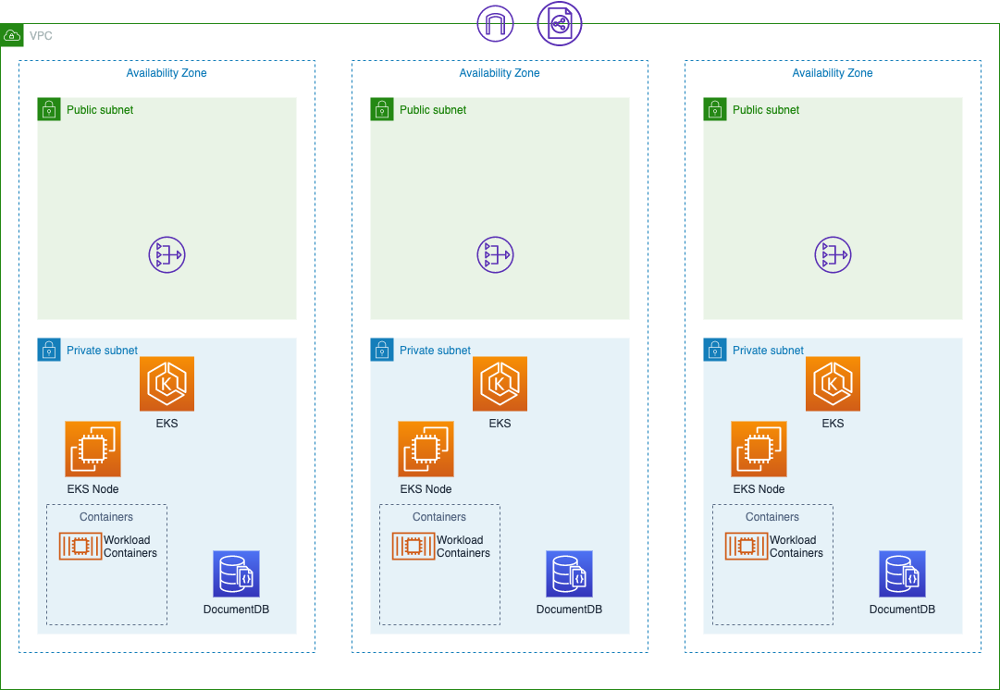
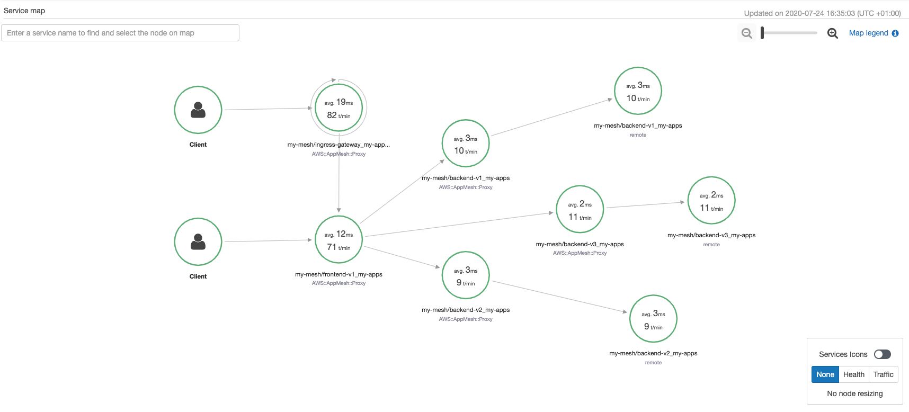
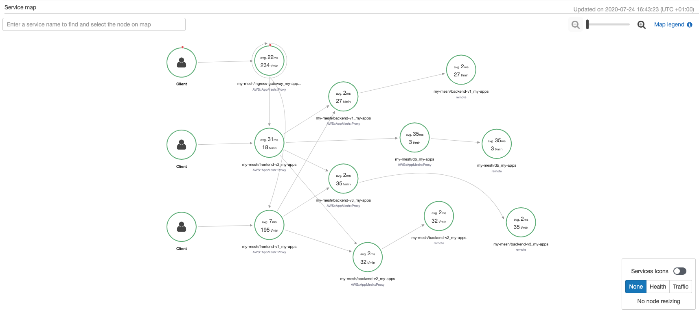

### README For App Mesh Demo using EKS 

This demonstration will set up the following resources in order to demonstrate App Mesh on top of EKS. 

- Cloudformation Template which deploys:
  - VPC with Public and Private subnets.
  - NAT Gateways in each AZ.
  - DocumentDB Cluster with 3 instances and tls disabled for connections.
  - Security group for DocumentDB cluster that allows access from the VPC CIDR range defined earlier. 
- EKS Cluster with the following characteristics:
  - 3 nodes deployed into the private subnets and using spot from the instance types m5a.2xlarge & m5.2xlarge.
- A Demonstration application consisting of frontend, backend and DB microservices

Since it can take around 20-30 minutes to deploy, it is advisable to do this prior to a customer meeting so the infrastructure is in place. 

This demo can be run from a Mac or Linux systems, or if looking for a uniform approach, the recommended method is AWS Cloud9.

The architeture of the demo looks as follows:



This is the infrastructure view, the logical service mapping view is a little different. 

In order to fully build the demo, run the following steps in order:

### Create a CodeCommit repository which you will push the code to since the code is currently hosted internally:

Your local system should have the following tools installed:
* [AWS CLI](https://aws.amazon.com/cli/)
* [Git](https://git-scm.com/downloads)


## Set up the deployment environment


If using a Cloud9 desktop, please use [this guide](https://github.com/dspaxton/EKS-App-Mesh/blob/master/SETUP-CLOUD9.md)

If using a Mac system, please use [this guide](https://github.com/dspaxton/EKS-App-Mesh/blob/master/SETUP-MAC.md)

Now that the working environment has been configured, you should download a copy of this repository.

```
git clone https://github.com/dspaxton/eks-app-mesh
```

Change into the directory `eks-app-mesh/setup`.

### Deploy EKS & App Mesh Controller 

1. Run `./setup-cluster-custom-vpc.sh` and provide answers to the questions for clustername and region .
1. Wait for the cloudformation and EKS cluster to be completed. This may take 20 - 30 minutes due to the resources being deployed. The terminal may not display anything for a while however you can open the CloudFormation console to observe the progress of the template deployment.
1. Once the setup has completed run `kubectl get nodes` to display the EC2 instances that have been deployed from the setup script. 
1. The setup script will deploy the following in addition to the EKS Cluster and VPC
   1. Fargate Profile for the appmesh-system namespace
   1. Association between IAM and the OIDC provider in the cluster for IAM Roles for Service Accounts (IRSA)
   1. A Service account that is granted full App Mesh control for manipulation of App Mesh resources.
   1. Installation of App Mesh using Helm.
   1. Installation of CloudWatch logs agent for Container Insights.
1. The namespace where the app is deployed will contain some labels which will assist with loading the sidecar envoy proxy and association with the Virtual Ingress Gateway that will be created. 
1. We will use [AWS X-Ray](https://console.aws.amazon.com/xray/home) to be able to visualise the connections between services.


### Deploy the application

The application that will be deployed is very simple however will show how services can be interconnected using the mesh. Initially there are four microservices, frontendv1, backendv1, backendv2 and backendv3. All are deployed as containers into the my-apps namespace and services created for them. Any time someone calls the frontend service, they are reaching a Virtual Service. App Mesh intercepts this and uses a Virtual Router definition to send to the actual frontendv1 service via a Virtual Node. The Virtual Router allows for using multiple backend Virtual Nodes. Similarly, for the first deployment, the frontendv1 application code is configured to talk to a backend service. Again, App Mesh uses a Virtual Service and Virtual Routers to intercept and send the traffic to the backend Virtual Nodes where the code is listening as backendv1, backendv2 and backendv3 services. 

Lets build the container images. 

Execute the script `./build_and_push.sh`

This script will do the following:
- Create an ECR Repository for each microservice in the `services/` directory.
- Log into ECR
- Build an image for each microservice
- Push the image to the associated ECR Repository
- Create deployment files for V1 and V2 of the application using the images that have been created. 

Once the `./build_and_push.sh` script has completed, run the following to deploy V1 of the application:
```
kubectl apply -f ../deploy/fullappv1-appmesh.yaml
```

This command creates the deployments which take care of launching the containers and the services which map onto those containers. This yaml file also includes the App Mesh resources for each kubernetes resource. Each kubernetes deployment must have an associated Virtual Node otherwise the deployment will not be permitted by the App Mesh Controller. The remaining Virtual Services, Virtual Router and Virtual Gateway (plus routes) are also created. The Virtual Gateway leverages a Network Load Balancer that forwards onto a Deployment of purely envoy proxies as per the documentation: [https://docs.aws.amazon.com/app-mesh/latest/userguide/virtual_gateways.html](https://docs.aws.amazon.com/app-mesh/latest/userguide/virtual_gateways.html)

You can view the pods that have been deployed by running `kubectl -n my-apps get pods`. The output should show something like the following:

```
NAME                               READY   STATUS    RESTARTS   AGE
backend-v1-5b979478cf-l7ztc        3/3     Running   0          45s
backend-v2-554b967c9f-f588v        3/3     Running   0          45s
backend-v3-6cfb5b4495-5rwr2        3/3     Running   0          45s
frontend-v1-65ff6ff49d-2pq8z       3/3     Running   0          45s
frontend-v1-65ff6ff49d-gmjkt       3/3     Running   0          45s
frontend-v1-65ff6ff49d-lqmdq       3/3     Running   0          45s
ingress-gateway-57dc5b988d-2fsp8   2/2     Running   0          45s
ingress-gateway-57dc5b988d-8chwx   2/2     Running   0          45s
ingress-gateway-57dc5b988d-jxj8h   2/2     Running   0          45s
```
The 3/3 shows that there are three containers running in each pod, one will be the service itself, one is the envoy proxy and the last is the x-ray sidecar. 

You can get the DNS name from the LoadBalancer either from the EC2 Console or from kubernetes. To get from kubernetes run:

```bash
kubectl -n my-apps get svc
```
It will take a few minutes for the Load Balancer to be provisioned, the targets registered and returning a healthy status for the health checks. 

Open a new browser tab and go to the address of the load balancer. It should return a Frontend title with a welcome and a line stating **This is v** and the version number of the backend which was chosen. Hit refresh several more times and then switch to the X-Ray console. Change the time period at the top right of the page from Last 5 minutes to Last minute. The service map should update and display a map of the services that are receiving traffic. If it doesn't immediately appear, wait a couple of minutes as the proxies may be still retrieving their configurations from the control plane. 

The X-Ray console should look something like this. 

**If you click on an element, then this will show response details about that element. In order to allow the console to refresh automatically, make sure to click Close on any element popups.** 



Since we are only looking at the last minute, it will soon show no activity if no requests are being made but this is where `wbox` comes in. We can use this to simulate traffic to the load balancer over a prolonged period. Open a new terminal and run `wbox <dns name of load balancer> clients 5 wait 0`.  This executes 5 requests per second. In X-Ray, the t/min value will increase to reflect the increased number of requests coming from wbox.

We can also look at [CloudWatch Container Insights](https://eu-west-1.console.aws.amazon.com/cloudwatch/home?region=eu-west-1#container-insights:infrastructure/map?~(query~()~context~())) and get some metrics from the pods and cluster as well as generate a heatmap. 

For the purposes of the demonstration, we're not doing any traffic management on the backend yet, all the backends receive an equal proportion of the traffic from the frontend. 


#### Deploy V2

V2 of the application involves a new DB service which makes calls to an AWS DocumentDB cluster that was created during the CloudFormation deployment, however the Database is presently empty so we need to populate with some items. A random product dataset can be generated using a schema defined in Mockeroo and then loaded into the DocumentDB Cluster. We have a kubernetes job that will do this for us. 


Run the following:
```bash
./dbloadjob.sh
kubectl get jobs --watch  -n jobs
```

When the job shows as complete (1/1) we can interrupt the watch command ```[Ctrl-C]``` and then delete the namespace with `kubectl delete ns jobs`

Now we can deploy V2 of the application (Remember we are also still running the simulated busy traffic to the application as it stands.)

Run `kubectl apply -f ../deploy/fullappv2-appmesh.yaml` and switch to the X-Ray Console tab. The map should update to show the new components (frontendv2 and db). 

If you switch to the tab where the application is loaded and hit refresh some more times, you should see a new line with *Latest stock info* and some JSON. This is being retrieved from the DocumentDB cluster by the new DB service and sent back to the frontendv2 container. 




So we now have additional components however right now everything is being balanced across all the different services, with no real control over what is returned to requests on the load balancer. 

Obviously in a production scenario, you would implement the rules functionality before launching new versions but this flow has been chosen to specifically address the value the service mesh adds. 


#### Applying routing rules to the mesh 

Now we have the application running, we can now experiment with some traffic management rules. 

Lets force all traffic to use only the V1 components. 

Run the following:

```bash
kubectl apply -f ../deploy/traffic/fullappv1-backendv1.yaml 
```

Looking at the file contents:

```
apiVersion: appmesh.k8s.aws/v1beta2
kind: VirtualRouter
metadata:
  namespace: my-apps
  name: backend-virtual-router
spec:
  listeners:
    - portMapping:
        port: 8080
        protocol: http
  routes:
    - name: backend-route
      httpRoute:
        match:
          prefix: /
        action:
          weightedTargets:
            - virtualNodeRef:
                name: backend-v1
              weight: 1
            - virtualNodeRef:
                name: backend-v2
              weight: 0
            - virtualNodeRef:
                name: backend-v3
              weight: 0
---
apiVersion: appmesh.k8s.aws/v1beta2
kind: VirtualRouter
metadata:
  namespace: my-apps
  name: frontend-virtual-router
spec:
  listeners:
    - portMapping:
        port: 8080
        protocol: http
  routes:
    - name: frontend-route
      httpRoute:
        match:
          prefix: /
        action:
          weightedTargets:
            - virtualNodeRef:
                name: frontend-v1
              weight: 1
            - virtualNodeRef:
                name: frontend-v2
              weight: 0
```

We can see the frontend and backend targets & the weights that have been applied. In this configuration we are purely using frontendv1 and backendv1. If still using the 1 minute observation period in X-Ray then after a minute or so, the resources not being called will disappear. 


You can validate the responses as well by viewing the application tab and refreshing a few times, you should only see responses from the V1 backend. 

You can experiment with different configurations by modifying the weightings and you can either use weightings such as 2:1:1 where the 2 gets 50% of the share and the others 25% each or you can explicitly call out percentage amounts by ensuring they all add up to 100. 

Now we can deploy a traffic configuration that equally balances requests across all 3 backends. 

```bash
kubectl apply -f ../deploy/traffic/fullappv1-backend-all.yaml 
```
Observe that in X-Ray, that backends V2 & V3 have appeared and are receiving a similar amount of traffic as the backend V1 service. Use the browser tab to also validate the responses. 

### V2 Traffic

Remember that we deployed frontend V2 as well but we're not calling it yet, but we can now briung it into the mix. 

```bash
kubectl apply -f ../deploy/traffic/fullappv2-frontend90-10.yaml
```
We arent changing the backend distribution so all 3 backends are called equally but with this change, we are sending 10% of the traffic to frontend V2. X-Ray will update after a minute or so to reflect the traffic being sent to Frontend V2 and will also show calls from Frontend V2 to the backend Virtual Service as well as the DB Virtual Service. 

Use the application browswer tab and refresh until you see calls that include the JSON information from the DB Service. 

Again you can experiment with the weightings to see how it impacts the responses. The file ```../deploy/traffic/frontend-backend-playground.yaml``` includes Virtual Router definitions for each Virtual Service to experiment with. Make sure to run ```kubectl apply -f ../deploy/traffic/frontend-backend-playground.yaml``` to commit the changes. 

Now we can consider the Frontend V2 and Backend V3 services as being suitable for exclusive use, we can run ```kubectl apply -f ../deploy/traffic/fullappv2-all-new.yaml``` to switch the configuration to using thse services. Again, observe through the X-Ray console and the application browser tab to validate that we are now using the newest versions. 

Finally, here's a logical diagram of what has been deployed:


## Cleanup 

Running the `cleanup.sh` script from the `setup` folder should tear down the resources however the Cloud9 desktop and IAM Role, eks-admin, should be deleted from the console. 

