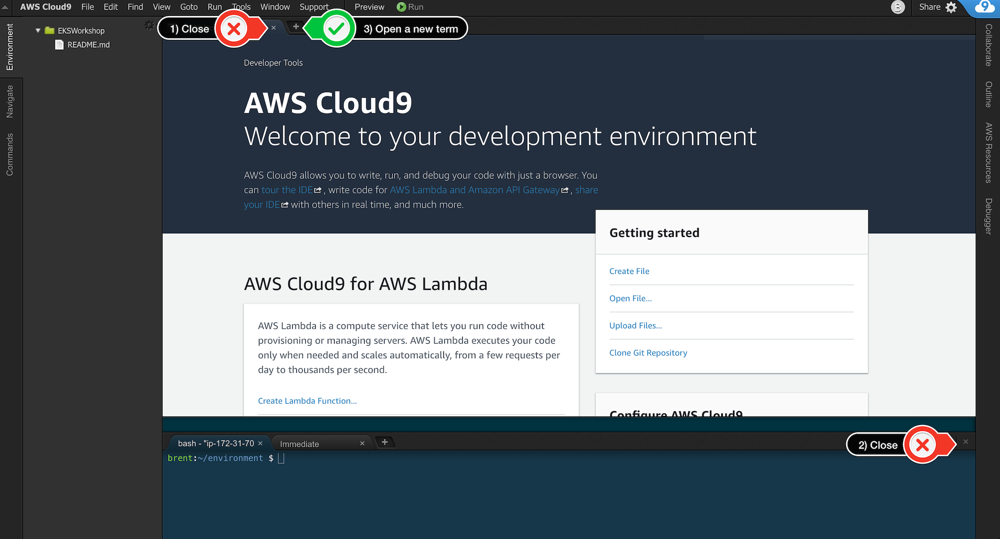
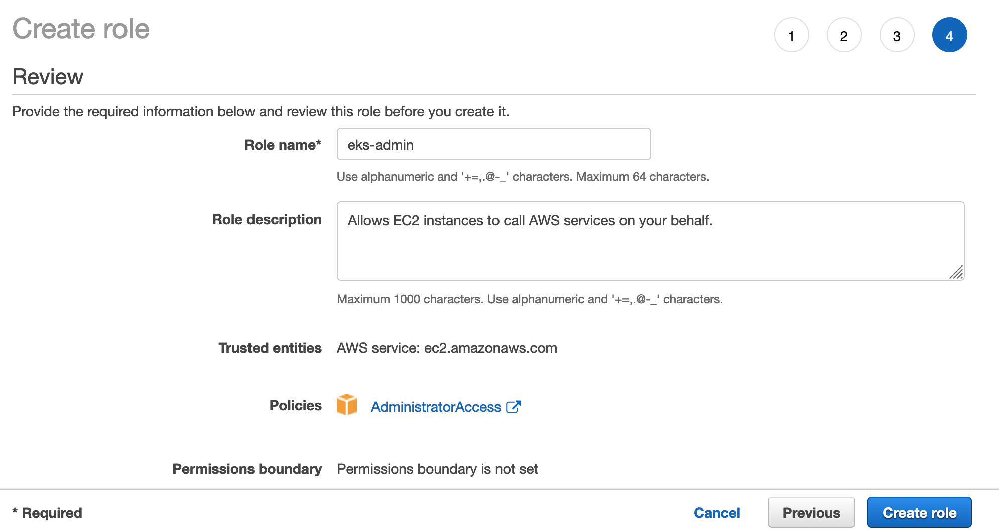
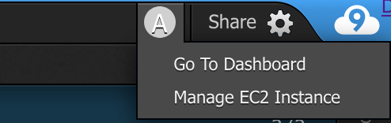
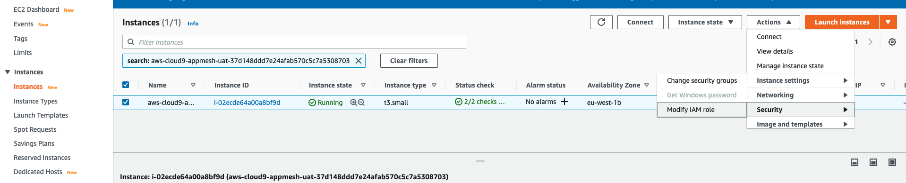
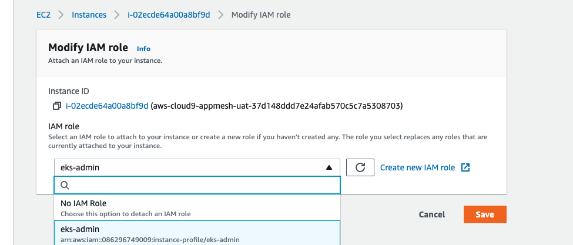

# Setting up Cloud 9 for EKS Istio Demo 

Create a Cloud9 Environment: [https://eu-west-1.console.aws.amazon.com/cloud9/home?region=eu-west-1](https://eu-west-1.console.aws.amazon.com/cloud9/home?region=eu-west-1)

Select Create environment

Give it an appropriate name and click Next.

Choose "t3.small" for instance type, take all default values and click Create environment

When it comes up, customize the environment by closing the welcome tab and lower work area, and opening a new terminal tab in the main work area: 



Should look like this when done


Amazon EKS clusters require kubectl and kubelet binaries and the aws-cli or aws-iam-authenticator
binary to allow IAM authentication for your Kubernetes cluster.


#### In this workshop we will give you the commands to download the Linux binaries. If you are running Mac OSX / Windows, please [see the official EKS docs for the download links.](https://docs.aws.amazon.com/eks/latest/userguide/getting-started.html)

#### Install kubectl
```
sudo curl --silent --location -o /usr/local/bin/kubectl https://amazon-eks.s3.us-west-2.amazonaws.com/1.16.12/2020-07-08/bin/linux/amd64/kubectl

sudo chmod +x /usr/local/bin/kubectl
```

You can get the most up to date kubectl from [this location](https://docs.aws.amazon.com/eks/latest/userguide/install-kubectl.html)

#### Install jq, envsubst (from GNU gettext utilities) and bash-completion
```
sudo yum -y install jq gettext bash-completion
```

#### Verify the binaries are in the path and executable
```
for command in kubectl jq envsubst
  do
    which $command &>/dev/null && echo "$command in path" || echo "$command NOT FOUND"
  done
```

#### Enable kubectl bash_completion
```
kubectl completion bash >>  ~/.bash_completion
. /etc/profile.d/bash_completion.sh
. ~/.bash_completion
```
#### Install of eksctl 

We need to download the [eksctl](https://eksctl.io/) binary:
```
curl --silent --location "https://github.com/weaveworks/eksctl/releases/download/latest_release/eksctl_$(uname -s)_amd64.tar.gz" | tar xz -C /tmp

sudo mv -v /tmp/eksctl /usr/local/bin

```

Confirm the eksctl command works:
```
eksctl version
```

Enable eksctl bash-completion
```
eksctl completion bash >> ~/.bash_completion
. /etc/profile.d/bash_completion.sh
. ~/.bash_completion
```
#### Upgrade the awscli to the latest version 

```
sudo pip install --upgrade awscli
```

#### Install wbox for making repeated calls to the service (the second command may show a lock but wait a few seconds and it should clear)

```
sudo yum install -y https://dl.fedoraproject.org/pub/epel/epel-release-latest-7.noarch.rpm
sudo yum -y install wbox
```

#### Install Helm
```
curl https://raw.githubusercontent.com/helm/helm/master/scripts/get-helm-3 > get_helm.sh
chmod 700 get_helm.sh
./get_helm.sh
```

#### Create IAM Role for workspace 

1. Follow [this deep link to create an IAM role with Administrator access.](https://console.aws.amazon.com/iam/home#/roles$new?step=review&commonUseCase=EC2%2BEC2&selectedUseCase=EC2&policies=arn:aws:iam::aws:policy%2FAdministratorAccess)
1. Confirm that **AWS service** and **EC2** are selected, then click **Next** to view permissions.
1. Confirm that **AdministratorAccess** is checked, then click **Next: Tags** to assign tags.
1. Take the defaults, and click **Next: Review** to review.
1. Enter **eks-admin** for the Name, and click **Create role**.



1. On the Cloud9 Environment, click on the letter at the top right next to the Share button and then click on **Manage EC2 Instance**



1. Select the instance, then choose **Actions / Instance Settings / Attach/Replace IAM Role**

1. Choose **eksworkshop-admin** from the **IAM Role** drop down, and select **Apply**



#### Update IAM settings for your Workspace


Cloud9 normally manages IAM credentials dynamically. This isn't currently compatible with
the EKS IAM authentication, so we will disable it and rely on the IAM role instead.


- Return to your workspace and click the sprocket, or launch a new tab to open the Preferences tab
- Select **AWS SETTINGS**
- Turn off **AWS managed temporary credentials**
- Close the Preferences tab


To ensure temporary credentials aren't already in place we will also remove
any existing credentials file:
```sh
rm -vf ${HOME}/.aws/credentials
```

Return to the main README.md file to continue

